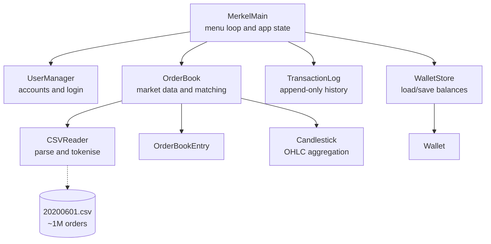

# Merklerex: C++ Crypto Exchange Simulator

A **console-based cryptocurrency exchange simulator** written in modern C++. It replays over **1 million real historical order-book entries** across several trading pairs. Users can register, log in, manage a multi-currency wallet, place bids and asks, and step the market forward through time while a **matching engine** fills their orders. Candlestick (OHLC) summaries can be printed for any product.

> My first substantial C++ project, built for a university Object-Oriented Programming module.


---

## Features

- **Five trading pairs** from real June 2020 market data: `BTC/USDT`, `ETH/BTC`, `ETH/USDT`, `DOGE/BTC`, `DOGE/USDT`
- **User accounts**: register, log in and reset a password; credentials persist between sessions
- **Wallets**: multi-currency balances, deposits and withdrawals; new users start with 10 BTC
- **Order placement**: submit asks (sell) and bids (buy) such as `ETH/BTC,200,0.5`, with automatic balance checks
- **Matching engine**: on each time step, asks and bids for every product are matched by price and wallets are settled
- **Market stats**: per-product ask count and min/max price at the current timestamp
- **Candlesticks**: open/high/low/close aggregated **daily, monthly or yearly** for any product and order type
- **Transaction history**: every trade and funds movement is logged; view your last 5 trades
- **Activity summary**: counts of your asks and bids, filterable by product, plus spending by timeframe

## How it works



| Class | Responsibility |
|---|---|
| `MerkelMain` | Application entry point: login screen, main menu, input validation, ties everything together |
| `OrderBook` | Holds all order-book entries; queries by product, time and type; runs the ask/bid **matching algorithm** |
| `OrderBookEntry` | A single order: timestamp, product, type, price, amount, owner |
| `CSVReader` | Tokenises CSV lines and converts them to order entries, with validation |
| `Candlestick` | Aggregates prices into OHLC bars per day, month or year |
| `Wallet` | Currency balances; checks whether an order can be fulfilled and processes sales |
| `WalletStore` | Persists wallets to `wallets.csv` |
| `UserManager` / `User` | Registration, login and password reset; persists to `users.csv` |
| `TransactionLog` / `Transaction` | Appends every trade and funds movement to `transactions.csv` and reads history back |

### Matching logic

For each product at the current timestamp, asks are sorted **lowest price first** and bids **highest price first**. A bid is matched to an ask whenever the bid price is at least the ask price. The trade executes at the ask price, partial fills carry the remainder forward, and the user's wallet is updated for any sale involving them. The simulation then advances to the next timestamp in the dataset.

### Wallet checks

- **Ask** on `ETH/BTC`: you must hold at least `amount` **ETH** (the base currency).
- **Bid** on `ETH/BTC`: you must hold at least `amount × price` **BTC** (the quote currency).

## Getting started

**Requirements:** a C++17 compiler (`g++`/MinGW-w64, `clang++` or MSVC)

```bash
git clone https://github.com/martinsnyman/merklrex_crypto_trader.git
cd merklrex_crypto_trader/src

g++ -std=c++17 -O2 -o merklerex *.cpp
./merklerex          # Windows: .\merklerex.exe
```

> Run the program **from inside `src/`** so it can find the dataset. Loading the full 1M-row dataset takes a few seconds. For a quicker start, switch to the smaller `20200317.csv` in `MerkelMain.h`.

On first run, `users.csv`, `wallets.csv` and `transactions.csv` are created automatically when you register. They are git-ignored, so your local accounts stay on your machine.

## Using the simulator

**1. Log in or register.** Registering generates a numeric username and seeds a few starter orders so you can see matching straight away.

**2. Main menu** (shown with the current market timestamp):

```
1: Print help                 6: Continue (match orders, advance time)
2: Print exchange stats       7: Print candlestick data
3: Make an offer (ask)        8: Manage funds (deposit/withdraw)
4: Make a bid                 9: Recent transactions
5: Print wallet              10: User activity summary
```

**3. Place an order** (options 3 and 4) as `product,price,amount`:

```
ETH/BTC,0.025,0.5
```

**4. Candlesticks** (option 7): choose a product, `ask` or `bid`, and `daily`, `monthly` or `yearly`. The output looks like:

```
Date        Open      High      Low       Close
```

## Project structure

```
merklrex_crypto_trader/
└── src/
    ├── main.cpp                  # Entry point
    ├── MerkelMain.{h,cpp}        # Menu loop and application logic
    ├── OrderBook.{h,cpp}         # Market data queries and matching engine
    ├── OrderBookEntry.{h,cpp}
    ├── CSVReader.{h,cpp}
    ├── Candlestick.{h,cpp}
    ├── Wallet.{h,cpp}  WalletStore.{h,cpp}
    ├── User.{h,cpp}    UserManager.{h,cpp}
    ├── Transaction.{h,cpp}  TransactionLog.{h,cpp}
    ├── 20200601.csv              # Full historical dataset (~1M rows)
    └── 20200317.csv              # Small dataset for quick testing
```

## What I learned

- **OOP design**: breaking a program into classes with single, clear responsibilities
- **STL containers and algorithms**: `std::vector`, `std::map`, `std::sort` with custom comparators
- **Parsing and validation**: tokenising CSV and user input safely, handling bad input without crashing
- **File I/O and persistence**: streaming a 60 MB dataset and saving user state across sessions
- **Algorithms**: implementing a price-priority order matching engine
- **Time handling**: grouping timestamps into daily, monthly and yearly buckets

## Limitations

- Passwords are hashed with `std::hash`. That's fine for a learning project but **not secure**; a real system would use a salted, slow hash such as bcrypt or Argon2.
- A single-user, single-process simulation with no networking or concurrency.
- Historical data is replayed rather than live, and user orders don't affect the recorded market.

---

**Author:** Martin Snyman · [GitHub](https://github.com/martinsnyman)
